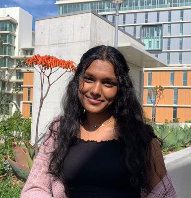
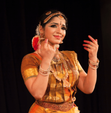

# Welcome to Prisha's User Page! 

## About Me: 
#### *Sophmore at UCSD*
#### *Computer Science Major* 
#### *Dance Minor* 

## Programmer:  
> * #### Recently, I've had the opportunity to develop my app development skills by working as a mobile iOS developer for UCSD Qualcomm Institute Calit-2. From my time there, I have gained important skills on sticking to strict deadlines, communicating with managers, and developing a industry-level product. My favorite app I created was a fetal alcohol syndrome (FASD) detection app, called MorpheusQ, which now in-use by a multitude of health professionals in scanning for FASD in children. 
>   #### 
> * #### In the future, I hope to use my technical skills in the fashion or retail industry as I feel as though there is little discussion regarding the ways tech can be harnessed for fashion trend forecasting and streamling many of the tasks that large fashion companies take on. Additionally, working for one of these companies will allow me to combine my interest in fashion with my knowledge of software development, bringing tech to a realm that is not traditionally associated with big tech ideals. 

## Hobbies: 
> * #### Besides programming, I am passionate about Indian classical dance called Bharatanatyam, which is something that I have been doing since I was 5 years old. Since my freshman year at UCSD, I have been a part of the competitive classical dance team, UCSD Pushpanjali. Being the marketing chair this year has allowed me to spread the culture behind tradtional Indian dance and continue to play an active role in something I am passionate about. I hope to continue dancing throught my time here at UCSD. 
>   #### 
> * #### I also enjoy listening to music, mainly rap, RnB and latin music. Some of my favorite artists right now are SZA, NBA Youngboy, Jhene Aiko, and Rosalia. Unfortunately I recently lost my airpods over spring break so I have not been able to spend as much time listening to music I would like to :(. 

## Fun Facts: 
#### 1. I have two younger siblings and all of our names start with "Pr". 
#### 2. I am scared of live fish. 
#### 3. I am really good at finding discounted items, like clothes. 
#### 4. I love making to-do lists. Here is one of the lists in my phone right now: 

### Week 1 To Do: 
 - [ ] buy hummus 
 - [ ] fold laundry 
 - [ ] begin two rady labs 
 - [x] send message on slack
 - [ ] zybooks week 1 reading
 - [ ] complete week 1 lab 

## Using Git: 
#### In order to make this page, I used the following git commands so that it would be under source control. 
```
git clone <repo_name>
git branch <branch_name>
git checkout <branch_name>
git commit -m "commit message here" 
```
See screenshots of the in-depth process here: [Using Git](https://github.com/prishaanand/Week-1-Lab)

Done Reading? Return back to the [Read Me Page](README.md)